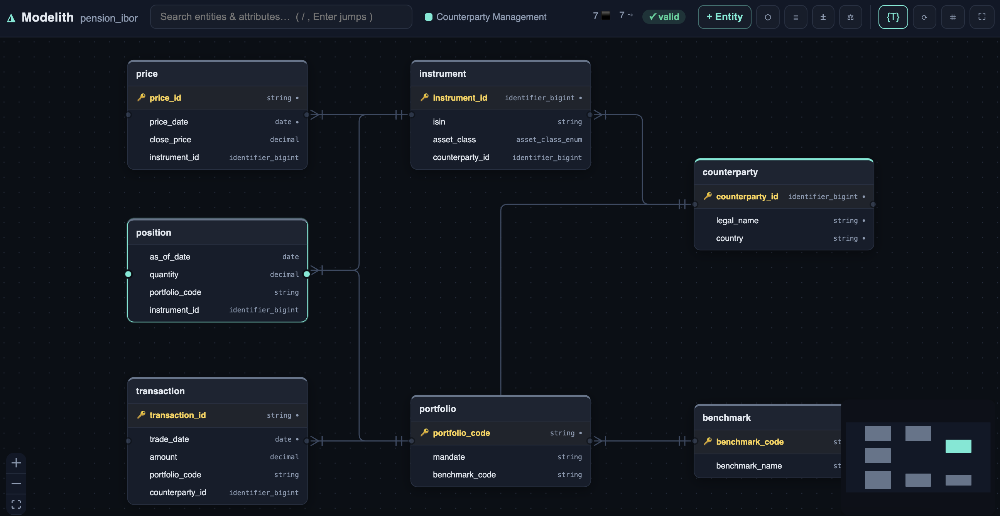
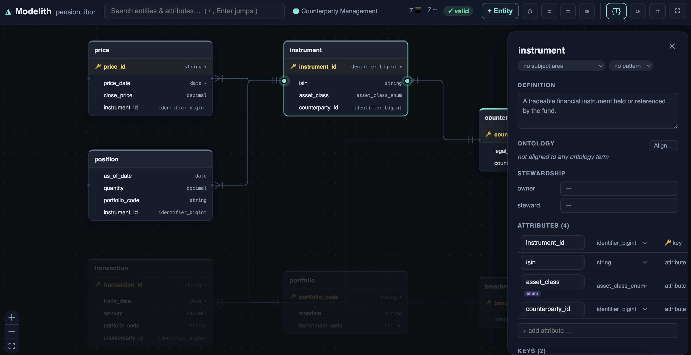
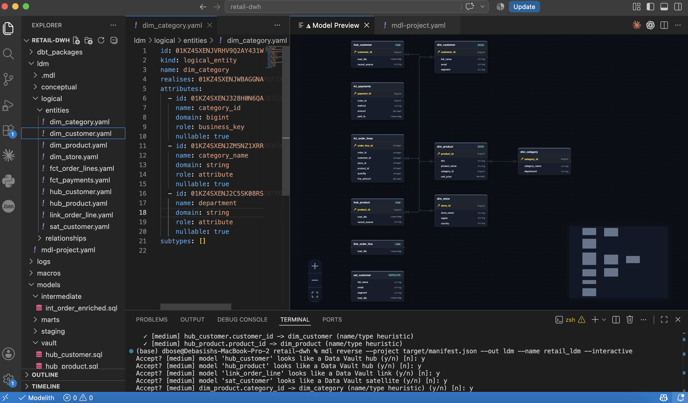
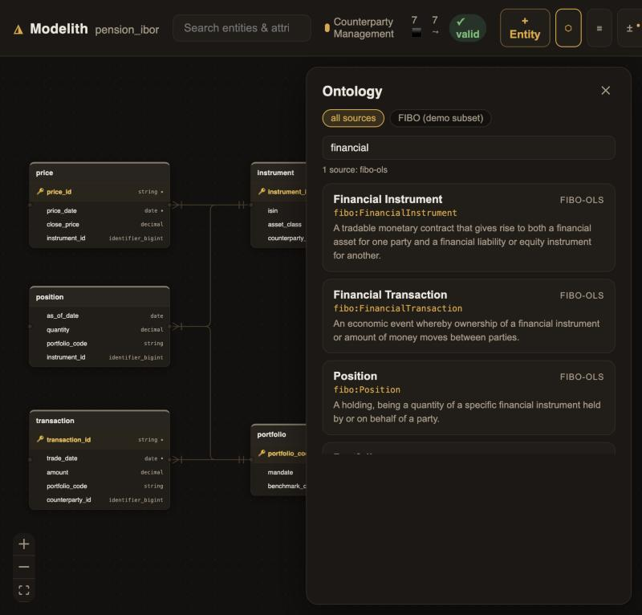
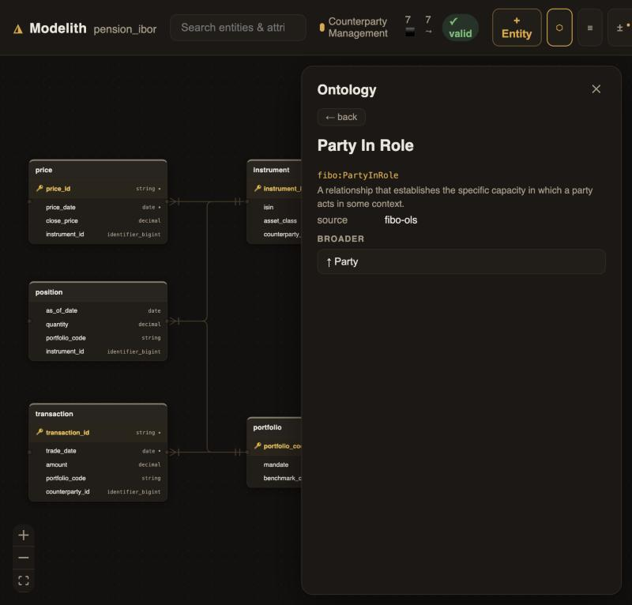
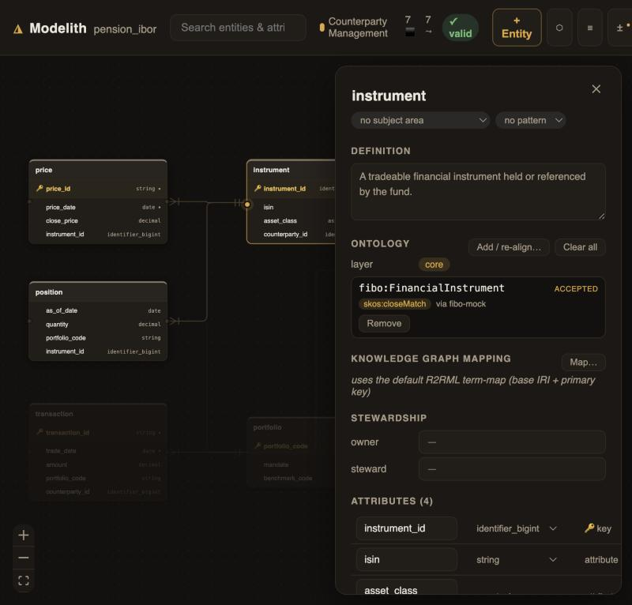
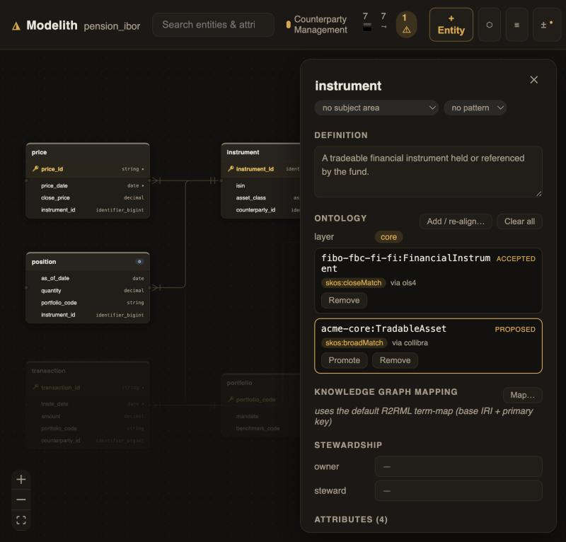

# Modelith

**Modelith is the modeling layer dbt-core is missing: design entities and relationships
in git, generate contract-enforced dbt, and catch drift before it ships.**

Design your model as an entity-relationship diagram, generate dbt from it, reverse an
existing warehouse back into a model, and get told exactly what drifted when the
warehouse changes underneath you. The model lives in git as plain YAML, so every surface
(the `mdl` CLI, the web canvas, the VS Code extension, CI) is a client and none of them
owns state.

[](https://github.com/dbose/modelith/actions/workflows/ci.yml)
[](pyproject.toml)
[](https://www.getdbt.com/)
[](#license)
[](https://docs.astral.sh/ruff/)



## Try it in 2 minutes

No cloud warehouse needed. The IBoR demo ships a model and a dbt project over a bundled
DuckDB, so it builds on a laptop.

```bash
uv tool install modelith-dbt
git clone https://github.com/dbose/modelith
cd modelith/demo/ibor

mdl validate -m model                 # the seven-entity model is valid
cd transform/warehouse && dbt build   # generated dbt builds green against DuckDB
cd ../.. && mdl serve -m model        # ER canvas + browse the (bundled) FIBO ontology
```

Then break a generated column's contract, run `dbt parse`, and
`mdl drift --check -m model --manifest transform/warehouse/target/manifest.json` reports
it as breaking. Or open the ontology browser in the canvas and align an entity to a FIBO
term — the demo starts a local ontology server for you. See
[demo/ibor](demo/ibor/README.md) for the full walkthrough and
[Ontology and knowledge graph, step by step](#ontology-and-knowledge-graph-step-by-step)
for the ontology workflow.

## Why

Warehouse teams keep their meaning in three disconnected places: an ER tool that
never sees production, dbt SQL that drifts from the design, and a governance catalog
nobody edits. Modelith puts one model in git and makes every tool read and write it.
You get a real data modeler (entities, attributes, keys, domains, relationships,
subtypes) that generates dbt you can actually run, verifies the warehouse still
matches the model, and reads a legacy dbt project (or an erwin export) back into a
clean logical model.

Because the model is a single source of truth, it compiles to more than dbt. From
one definition, Modelith emits an ER canvas, contract-enforced dbt, an Open Data
Contract Standard (ODCS) contract, Pydantic models for your Python services, a Neo4j
graph schema, and RDF/OWL/SHACL, each generated deterministically. Model once, ship
the warehouse, the typed application code, the graph, and the governance contract
together.

Nothing here is a mockup. Every capability below is exercised by the test suite and,
where it touches SQL, by a real `dbt build` against DuckDB.

### How it compares

|  | Modelith | dbt alone | erwin / ER tool | Hand-rolled contracts |
|---|---|---|---|---|
| Visual ER model | Yes | No | Yes | No |
| Generates runnable dbt | Yes | n/a | No (DDL only) | No |
| Round-trip safe (keeps hand edits) | Yes | n/a | No | n/a |
| Drift caught + classified | Yes | No | No | Manual |
| Reverse an existing dbt project | Yes | No | No | No |
| Compiles one model to many targets | Yes | No | No (DDL only) | No |
| Lives in git, no server to run | Yes | Yes | No (desktop app) | Yes |
| Ontology / governance alignment | Yes | No | Partial | No |

## Install

The PyPI package is named `modelith-dbt` (the bare `modelith` name belongs to an
unrelated project). It installs a single command, `mdl`.

```bash
uv tool install modelith-dbt    # isolated tool install, puts `mdl` on your PATH
# or: pipx install modelith-dbt
# or into an existing environment: pip install modelith-dbt
mdl --help
```

Modelith runs in the same environment as dbt-core (Python 3.11+). One install gives
you the whole toolchain: the CLI, the web canvas (`mdl serve`), the language server,
reverse engineering, drift detection, and the ontology and governance stack.

### VS Code, Cursor, Windsurf

The editor extension drives the same `mdl` CLI, so install the CLI first (above),
then add the extension. It is published on Open VSX, so it installs directly in VS
Code, Cursor, Windsurf, and VSCodium: open the Extensions panel and search for
**Modelith**, or install from the command line.

```bash
code --install-extension modelith.modelith-vscode        # VS Code
# cursor --install-extension modelith.modelith-vscode    # Cursor
```

### From source

To run the in-repo development version, or before the package reaches your index:

```bash
git clone https://github.com/dbose/modelith
cd modelith
uv tool install .        # builds and installs the local checkout as `mdl`
```

## Quickstart

```bash
mdl init my-model                          # scaffold a model repo
mdl new entity customer -m my-model        # add an entity (mints ULIDs)
mdl validate -m my-model                   # schema, refs, naming, ontology
mdl generate -m my-model -o warehouse      # emit contract-enforced dbt
mdl serve -m my-model                       # open the visual canvas
```

`mdl generate` writes dbt models with protected regions, a `schema.yml` carrying
contract constraints, and a three-way merge on regeneration, so your hand edits and
the generated blocks both survive.

```text
$ mdl validate -m my-model
validation passed

$ mdl generate -m my-model -o warehouse
  created          models/customer.sql
  created          models/schema.yml
wrote 2 files to warehouse
```

## The visual canvas

`mdl serve` opens an ER canvas in the browser (also embeddable as a VS Code webview).
It is a full editor, not a viewer: drag between entities to draw a relationship, edit
attributes and keys inline, align a term to an ontology, and commit from a git panel.
Every edit is a typed, comment-preserving mutation with optimistic concurrency, so two
people can work the same repo without clobbering each other.



The inspector above shows one entity carrying an enumerated domain (`asset_class`),
a named primary key and a unique key, user-defined properties, and its relationships,
all first-class in the model.

## In VS Code

Install the extension from `vscode/modelith-vscode-0.1.0.vsix`:

```bash
code --install-extension vscode/modelith-vscode-0.1.0.vsix
```

The extension does not bundle its own copy of the canvas. It launches `mdl serve`
and embeds the live canvas, so whatever the CLI understands, the editor shows. The
model files stay in git; the extension is just another client over them.

**Side by side: YAML, SQL, and the canvas.** Right-click a model file in the
Explorer (or in the open editor) and choose **Modelith: Open Model Preview to the
Side**. The canvas opens in a split beside your file and follows the active editor:
open `instrument.yaml` and the canvas centers on that entity; switch to a generated
`.sql` file and the preview tracks it. Save the YAML and the preview re-renders. You
read and edit the model as text on the left, watch the diagram update on the right,
and keep the generated dbt SQL a tab away, all in one window.



For a full editing session, **Modelith: Open Canvas** opens the editable canvas as
its own tab (drag-to-connect relationships, inline attribute and key editing,
git commit panel). The preview-to-the-side is the read-along companion while you work
in text; the full canvas is where you drive structural edits.

What the extension adds on top of the canvas:

- **Diagnostics on save.** `mdl validate` runs when you save a model YAML and surfaces
  `MDL-*` findings in the Problems panel, mapped to the file that declares the issue.
- **Language server.** `mdl lsp` drives drift and contract diagnostics on the generated
  dbt files, hover cards (glossary term, ontology IRI, owner), and code actions (adopt a
  column, lift a model, unmanage, declare a relationship).
- **Commands.** Generate the dbt project, check drift, lint and fix naming, scaffold a new
  entity, vendor an ontology, emit the semantic layer, all from the command palette.
- **YAML completion.** JSON Schemas exported from the model are registered with the Red Hat
  YAML extension, so authoring the YAML by hand is schema-checked and autocompleted.
- **Devcontainer-ready.** The extension declares `extensionKind: ["workspace"]`, so in a
  devcontainer the server and the `mdl` toolchain run next to dbt and your warehouse
  credentials, not on the laptop.

Detection resolves `mdl` in order: an explicit `modelith.mdlPath` setting, a project
`.venv`, `mdl` on PATH, the active conda or virtualenv, then the common per-user install
locations. A standard `uv tool install modelith-dbt` needs no configuration.

## What it models

Modelith represents the core data-modeling taxonomy as first-class, git-tracked objects:

| Concept | Support |
|---|---|
| Conceptual / logical / physical layers | Separate object kinds, referenced by immutable ULID |
| Entities and attributes | Name, domain, role (business key / surrogate / attribute / measure), nullability |
| Relationships | Four cardinalities, identifying vs non-identifying, optionality, crow's-foot rendering |
| Named keys | Primary, alternate, unique, and index key groups with ordered, composite members |
| Domains and reference data | Reusable domains, inline enumerations, and shared code sets that emit dbt `accepted_values` tests |
| Subtypes and supertypes | Category clusters with a discriminator and a physical materialization strategy (single-table or table-per-subtype) |
| User-defined properties | Extensible metadata on any object, flowing through to dbt `meta` |
| Subject areas | Diagram partitioning with color grouping on the canvas |
| Ontology alignment | Four-layer stack (industry / core / domain / specialised), SKOS predicates, a list of `ontology_refs` per object with provenance; local files, lockfile-pinned bundles, or live resolvers (OLS / OntoPortal / Collibra) |
| Design patterns | SCD2 and Data Vault (hub / link / satellite), emitting working SQL, not stubs |

## What it does

**Forward engineering.** Generate dbt-core models with enforced contracts, primary and
unique key constraints, relationship tests, and platform-specific types for DuckDB,
Snowflake, Redshift, Iceberg, and Trino. Regeneration runs a three-way merge so hand
edits survive.

**Compile targets.** The same model compiles to more than dbt, each target generated
deterministically from the one definition:

| Target | Command | What you get |
|---|---|---|
| dbt-core | `mdl generate` | Contract-enforced models with keys, tests, and platform types |
| Data contract | `mdl export contract` | An Open Data Contract Standard (ODCS v3) `datacontract.yaml`: schema, keys, valid values, and ownership |
| Pydantic | `mdl emit pydantic` | Pydantic v2 models for Python services and agents, with nullability and enum enforcement |
| Neo4j | `mdl export graph` | A Cypher schema: node-key, unique, and existence constraints, plus relationship types |
| Semantic layer | `mdl emit semantic` | MetricFlow semantic models and metrics, or OSI |
| Ontology | `mdl export rdf` / `shacl` | RDF/OWL with SKOS alignments, and SHACL shapes |
| Knowledge graph | `mdl export r2rml` | A W3C R2RML mapping: the deterministic term-map from warehouse rows to typed, ontology-aligned graph nodes; fails loud on any unmapped entity unless `--allow-unmapped` |

`mdl generate --emit-contract` (also `--emit-pydantic`, `--emit-graph`, `--emit-r2rml`)
turns Modelith into a contract factory: on every regeneration it drops a fresh, valid
artifact at the model root, so a git tag or CI step keeps the contract in lockstep with
the model.

**Optional knowledge graph.** If your team wants a first-class knowledge graph, the same
model emits a standards-correct **R2RML** mapping (`mdl export r2rml`); if not, ignore it.
R2RML is the W3C mapping standard whose durable idea is the term-map: a deterministic
function from primary-key columns to a node IRI, so a warehouse row and a graph node are
provably the same entity, aligned to the ontology IRIs the model already carries. Modelith
emits the mapping, not triples, so the warehouse stays the store. Feed the mapping to
[Ontop](https://ontop-vkg.org/) for a virtual SPARQL endpoint over the warehouse (no copy,
always fresh), or to [Morph-KGC](https://github.com/morph-kgc/morph-kgc) to materialize a
triple store. `mdl export graph` (Neo4j Cypher) is the property-graph sibling.

The term-map is customisable: set a project `kg_base_iri` for your own namespace, and add
per-entity or per-attribute `term_map` overrides (subject IRI template, class IRI,
predicate IRI, datatype), authored in YAML or through the canvas Inspector (and the VS Code
extension). Entities you have aligned to an ontology are typed with that aligned IRI
automatically. See [docs/knowledge-graph.md](docs/knowledge-graph.md).

**Reverse engineering.** Point `mdl reverse` at a compiled dbt project (`manifest.json`
plus `catalog.json`) and get a logical model back. It excludes staging and intermediate
models, collapses SCD2 column triples into a pattern, strips surrogate keys (keeping a
conformed dimension's natural key), marks reporting rollups unmanaged rather than minting
keyless entities, detects Data Vault structures, and infers relationships from tests and
naming, recording every decision in a reviewable ledger. After the run it prints a
classification summary (what was excluded, marked a rollup, or stripped) so a
misclassification on non-standard naming is visible immediately, not discovered at PR
time; the conventions it keys off are overridable via `mdl reverse --naming <file.yaml>`
(medallion `gold_`, `f_`/`d_`, non-English). See [Reverse engineering a real warehouse](#reverse-engineering-a-real-warehouse) below.

**Drift detection.** `mdl drift` compares the committed model to a compiled warehouse and
classifies each difference as breaking, additive, or cosmetic, with a CI gate mode and a
reconcile mode. A 400-model breaking change classifies in under thirty seconds.

**Ontology anchoring.** Bind your entities and attributes to industry and enterprise
ontology terms, browse and search those ontologies from the canvas or your editor, pin
them reproducibly, and export a knowledge graph that fails loudly on anything unmapped.
See [Ontology and knowledge graph, step by step](#ontology-and-knowledge-graph-step-by-step)
below.

**Governance sync.** A neutral governance graph maps to an external catalog through a
customer-owned Jinja profile. A Collibra adapter ships, along with OpenLineage emission
and a conformance kit that validates a bespoke mapping in CI.

## Reverse engineering a real warehouse

`mdl reverse` lifts a compiled dbt project into a logical model. On a real, organically
grown warehouse the heuristics do a lot automatically — but their conventions are
US-dbt/Kimball by default, so a shop with different naming (medallion `bronze_`/`gold_`,
`f_`/`d_` facts and dims, non-English) can be misclassified. Two things make that safe:
a **classification review** that surfaces every decision, and a **`--naming` override**
that teaches reverse your conventions.

### 1. Reverse and read the review

```bash
mdl reverse --project transform/target/manifest.json --out model
```

Reverse excludes staging/intermediate models, detects SCD2 dimensions, strips surrogate
keys (while keeping a conformed dimension's natural key, e.g. `date_key` on `dim_date`),
marks keyless reporting rollups (`mart_`/`rpt_`/`agg_`) as unmanaged rather than minting
junk entities, and infers relationships from tests. Every decision lands in a reviewable
ledger, and it prints a summary grouped by the rule that fired:

```text
Classification review

kept as business entities (2)
  dim_customers, dim_date
managed but no business key (check these) (1)
  gold_daily_kpi
excluded as staging/intermediate (1)
  stg_raw
surrogate keys stripped (1)
  dim_customers.customer_sk
```

The `managed but no business key (check these)` group is the tell: anything there is
likely a rollup or view whose naming reverse didn't recognise. (Use `--no-review` to
silence the summary in scripts.)

### 2. Override the naming conventions

If the review shows misses, point reverse at a YAML of overrides. **Everything is
additive** — merged with the built-in defaults — so you declare only what's
non-standard; `stg_`/`dim_`/`mart_`/`_sk`/`valid_from` keep working:

```yaml
# naming.yaml — reverse conventions for a German medallion warehouse
reverse:
  staging_prefixes: [bronze_, silver_]   # raw + cleansed layers -> excluded like stg_/int_
  rollup_prefixes:  [ber_]               # ber_ (Bericht = report) -> reporting rollup
  strong_surrogate_suffixes: [_hs]       # this shop hashes keys as _hs, not _sk
  scd2_from: [gueltig_ab]                # SCD2 validity columns in German
  scd2_to:   [gueltig_bis]
```

```bash
mdl reverse --project transform/target/manifest.json --out model --naming naming.yaml
```

Now `bronze_`/`silver_` are excluded, `ber_` tables become unmanaged rollups, `_hs`
columns are stripped as surrogate keys, and `gueltig_ab`/`gueltig_bis` are recognised as
an SCD2 pair. The overridable lists (all additive):

| Key | What it matches |
|---|---|
| `staging_prefixes` / `staging_tags` | models excluded as staging/intermediate |
| `rollup_prefixes` / `rollup_tags` | keyless reporting rollups kept unmanaged |
| `strong_surrogate_suffixes` | key suffixes always stripped as surrogates (`_sk`, `_hk`, …) |
| `surrogate_exact` | exact column names that are surrogate/hash columns |
| `hash_types` | physical types that mark a `_key` column as a hash surrogate |
| `scd2_from` / `scd2_to` / `scd2_current` | SCD2 validity column names |

You can also drop the same `reverse:` block into your project's `mdl-project.yaml` under
`naming:` — re-reverses then pick it up without the flag.

## Ontology and knowledge graph, step by step

Modelith treats an ontology the way a build treats a dependency: you declare a source,
pin it, and reference terms — nothing is copied into your repo by hand. A term can come
from a local file, a public registry, or an enterprise catalog, and it is bound and
pinned identically regardless of where it was found. This section walks the whole loop.

Everything below works offline against the bundled IBoR demo, which ships a small mock
FIBO server that `mdl serve` starts for you:

```bash
cd demo/ibor
mdl serve -m model        # opens the canvas AND auto-starts the demo ontology server
```

### 1. Declare an ontology source

A source is one entry in `ontology_stack` in `mdl-project.yaml`. It is either a **local
file** vocabulary or a **remote resolver** browsed live. All four types are configured
the same way:

```yaml
ontology_stack:
  - name: fibo                       # a local RDF/OWL/Turtle vocabulary
    layer: industry
    format: turtle
    path: ontologies/industry/fibo/2024.03
    prefixes:
      fibo: "https://spec.edmcouncil.org/fibo/ontology/"

  - name: ols                        # public OLS4 (no auth) — live search only
    layer: industry
    type: ols
    url: https://www.ebi.ac.uk/ols4/api

  - name: bioportal                  # OntoPortal / BioPortal (API key)
    layer: domain
    type: ontoportal
    url: https://data.bioontology.org
    apikey_env: BIOPORTAL_APIKEY

  - name: collibra                   # Collibra Ontology Domains (bearer token)
    layer: core
    type: collibra
    url: https://acme.collibra.com
    token_env: COLLIBRA_TOKEN
    domain_types: [Ontology]
```

`layer` places the source in the four-layer stack (industry / core / domain /
specialised). A remote resolver is strictly a live-lookup convenience — it is never a
build-time dependency, and its API keys/tokens are read from environment variables, never
stored in the repo.

### 2. Pin and fetch (reproducible builds)

For a source you want pinned to an exact version, lock it and fetch it. The lock records
a sha256; the content lands in a **gitignored** cache, never committed:

```bash
# pin an immutable file/URL (artifact mode), binding its prefix so IRIs resolve offline
mdl ontology lock industry https://spec.edmcouncil.org/.../fibo.ttl \
  --mode artifact --version 2024.03 \
  --prefix fibo --prefix-iri "https://spec.edmcouncil.org/fibo/ontology/"

# pin a live triple store as a point-in-time snapshot (endpoint_snapshot mode)
mdl ontology lock enterprise https://ontology.internal/sparql \
  --mode endpoint_snapshot --snapshot-tag 2026-08-15

# on a fresh clone / in CI: fetch + hash-verify every locked layer, fail-closed on drift
mdl ontology fetch
```

`mdl ontology fetch` is the `dbt deps` / `npm ci` of ontologies: it reproduces the exact
pinned content into `.mdl/ontology-cache/` and aborts if a hash no longer matches. For a
small private ontology you would rather review in git, `mdl ontology add <file>` vendors
it into the repo and wires the source entry for you instead.

### 3. Browse, search, and align

Open the canvas (`mdl serve`) and click the ontology browser (the ⬡ toolbar button):

1. Pick a **source** from the chips at the top (or "all sources"). Picking one scopes
   search to that vocabulary — essential when a catalog has millions of terms.
2. Type a query. Hits come back live, tagged with their source, with definitions and a
   class hierarchy you can drill into. Glossary terms and ontology classes are
   distinguished with a badge.
3. Select an entity, and in its inspector click **Align…**. Search, pick a term, choose a
   SKOS predicate (`exactMatch` / `closeMatch` / `broadMatch`), and confirm.



Every hit drills into a detail card with its definition, source, and class hierarchy:



The alignment is written into the entity's YAML under `ontology_refs` — a **list**, so an
object can carry several bindings — with `resolved_via` provenance recording which
resolver found it. A term picked from a remote resolver is also snapshotted into the local
cache so it still validates and exports offline.



You can also align in YAML directly, with autocomplete. In VS Code / Cursor / Windsurf (or
any LSP editor), typing under `ontology_refs:` on a `uri:` line offers ranked completions
from every configured resolver, showing the term label, source, and definition:

```yaml
ontology_layer: core
ontology_refs:
  - predicate: skos:exactMatch
    uri: fibo:FinancialInstrument     # <- autocompletes against your ontology sources
    resolved_via: ols
```


### 4. Reverse an existing project, then align in bulk

Reversing a dbt project (`mdl reverse`) lifts a logical model but leaves it unaligned. The
**alignment pass** proposes bindings for the whole model at once, matching each entity and
attribute against the *merged closure* of every configured source (public plus enterprise
extensions), and writes ranked candidates to the decision ledger — **nothing is
auto-applied**:

```bash
mdl ontology align                 # propose alignments -> .mdl/decisions.yaml
```

Each proposal carries a confidence and its candidate list. A subject-matter expert reviews
and accepts them in the glossary app (or `mdl ontology promote`), which is what writes the
final alignment and its audit trail (`resolved_by`, `approved_at`) into the model. An
object can end up with several bindings — an accepted one and a proposed one awaiting
review, each showing its predicate and source:



### 5. Validate coverage

```bash
mdl ontology check                 # four-layer rules + industry-coverage report
mdl validate                       # includes ontology-layer diagnostics
```

`check` reports the CDO-facing coverage number (what share of core terms are aligned) and
flags downward alignments, non-SKOS predicates, exactMatch cycles, and unresolvable IRIs.

### 6. Export the knowledge graph (fail-loud)

With entities aligned, emit the R2RML mapping. By default it **fails loudly** and lists
anything still unmapped, rather than silently minting placeholder IRIs:

```bash
mdl export r2rml                   # fails if any managed entity/attribute is unmapped
mdl export r2rml --allow-unmapped  # mint fallback IRIs on the project base instead
```

Feed the mapping to [Ontop](https://ontop-vkg.org/) for a virtual SPARQL endpoint over
your warehouse, or to [Morph-KGC](https://github.com/morph-kgc/morph-kgc) to materialize a
triple store. The mapping, the lockfile, and the alignments are all git-tracked and
reproducible; the fetched ontology content is not. See
[docs/knowledge-graph.md](docs/knowledge-graph.md).

**Semantic layer.** Emit MetricFlow semantic models and metrics, or OSI (version-isolated),
with joinability and fan-out validation.

**Collaboration.** A structural, ULID-keyed git merge driver lets two people add different
attributes to the same entity and merge cleanly. A change classifier routes pull requests
to the right reviewers, a debt valve records engineer-owned SQL with an expiry, and a
git-native glossary app lets subject-matter experts propose definitions as pull requests
without ever seeing git or a CLI.

## Cross-repo model catalog

By default a Modelith project is one repo, worked on privately alongside its dbt — you
never need a catalog. When an org has *many* model repos, the catalog is the level above:
a browsable index of every published model, discovered without checking any of them out.

It is base-tier and decoupled from governance: it needs no Collibra, no profile, no
adapter, and works with zero configuration. (A governance adapter may optionally read the
same manifest, never the reverse.)

**Publish** — run in CI on merge to main, next to `mdl gov publish` where that's
configured, but with no governance config required:

```bash
mdl catalog publish            # writes one manifest entry: name, namespace, git
                               # remote+commit, ontology layers, published-at
```

The default backend is a **git-native manifest repo** — one human-readable YAML entry per
model, no database or server. Publishing is idempotent (same commit = no-op) and the
catalog is **rebuildable, not authoritative**: if it's ever lost, replaying `mdl catalog
publish` from every model repo's CI reconstructs it. Configure the catalog repo in
`.modelith/catalog.yaml`:

```yaml
catalog:
  backend: git
  remote: git@github.com:acme/model-catalog.git
```

**Browse** — one level above any repo, a searchable/filterable list of every model with
links out to each source repo@commit (pointers only; model detail is fetched from the
source on demand):

```bash
mdl catalog serve              # http://127.0.0.1:4811/catalog
mdl catalog list --search fibo # or from the terminal
```

The browse view lists each published model with its ontology-layer chips, short commit,
publish date, and a link out to the source repo@commit — searchable by name, namespace, or
layer, and filterable by layer chip.

Click a model and the catalog opens its **LDM canvas** in-app: the backend materialises
that entry's model (the git backend checks the source repo out at the pinned commit into a
local cache) and mounts a read-only canvas at `/view/<slug>`. The catalog stays a pointer
index — the checkout is a disposable cache, never a second source of truth, and the canvas
is read-only because editing happens in each model's own private workspace. Materialisation
is a backend concern: an S3 or DataHub backend fetches the model bundle its own way behind
the same interface, and a backend that can't materialise degrades to the source-repo link.

Additional backends (S3, DataHub, …) install as separate adapter packages behind the same
`CatalogBackend` interface; the git backend is the reference implementation.

**Try it with the bundled demos.** The repo ships three model demos (`demo/ibor`,
`demo/legacy-warehouse`, `demo/retail-dwh`). A seed script turns each into a throwaway
local git repo and publishes it, so the catalog lists all three and clicking any card
opens its LDM canvas:

```bash
uv run python scripts/catalog_demo_seed.py   # publish the 3 demos into a local catalog
uv run mdl catalog list                      # confirm: pension_ibor, legacy_reversed, retail_ldm
uv run mdl catalog serve                      # http://127.0.0.1:4811/catalog
```

Open http://127.0.0.1:4811/catalog and click a model — it checks that demo out at its
pinned commit and renders its read-only ER canvas at `/view/<slug>`. Everything the script
writes lives under `.catalog-demo/` and `~/.modelith/`, so it never touches your working
tree; remove it with `rm -rf .catalog-demo ~/.modelith/catalog-cache ~/.modelith/sources`.

## Surfaces

| Surface | What it is |
|---|---|
| `mdl` CLI | The full command set: init, validate, lint, generate, reverse, drift, serve, glossary, ontology, emit, export, import, gov, and more |
| Web canvas | `mdl serve` opens the ER editor; state stays in git |
| VS Code extension | Canvas beside your YAML (follows the active editor), full canvas tab, diagnostics on save, generate / drift / lint commands, YAML completion, devcontainer-ready. See [In VS Code](#in-vs-code). |
| Language server | `mdl lsp` (one server for VS Code, Cursor, Windsurf, JetBrains, and CI): drift and contract diagnostics on the dbt files, hover cards, code actions |
| Glossary app | `mdl glossary` serves a narrow, git-native glossary surface for subject-matter experts |

## CLI reference

```text
mdl init [--workspace] [--git-hooks]              scaffold a model repo or full topology
mdl new entity|term|subject-area <name>           add an object (ULIDs minted)
mdl delete entity <name> [--cascade]              remove an object, safely
mdl validate [--format json]                      schema, refs, ontology, naming
mdl lint [--fix]                                  naming-standards lint
mdl generate [--target] [--emit-contract] [...]   emit the dbt project (+ optional targets)
mdl reverse --project <manifest|schema.yml> [--naming <f>]  lift a dbt project into a model
mdl drift --manifest <m> [--check|--reconcile]    compare model to compiled warehouse
mdl serve [--read-only]                           web canvas + read API
mdl glossary [--read-only]                        SME glossary app
mdl ontology search|check                         browse; layer rules + coverage report
mdl ontology lock|fetch|add                       pin a source, fetch+verify, vendor a file
mdl ontology align|promote                        propose alignments (§2), accept them
mdl emit semantic --format metricflow|osi         semantic layer
mdl emit pydantic                                 Pydantic v2 data models
mdl export contract|graph                         ODCS data contract, Neo4j Cypher schema
mdl export r2rml [--allow-unmapped]               R2RML KG mapping (fails loud on unmapped)
mdl export json-schema|rdf|shacl                  interchange out
mdl import osi|erwin                              interchange in
mdl gov plan|apply|pull|publish|import            governance catalog sync
mdl catalog publish|list|serve                    cross-repo model catalog (one level above)
mdl classify | unmanage | debt | decisions        collaboration and review
```

## Layout

```
packages/
  core/           IR, ULID identity, YAML round-trip, validator, merge engine (no in-repo deps)
  emit-dbt/       dbt-core emitter, platform adapters, SCD2 macros
  reverse/        manifest + catalog reader, drift, reverse engineering, decision ledger, erwin import
  ontology/       vocabulary registry, four-layer validation, RDF/OWL + SHACL export
  emit-semantic/  MetricFlow + OSI, joinability validation
  governance/     governance graph, Jinja mapping DSL, adapter SPI, conformance kit, OpenLineage
  catalog/        cross-repo model catalog: entry, backend SPI, git manifest backend
  adapters/
    collibra/     Collibra governance adapter
  server/         read API (FastAPI) + hosts the canvas build
  lsp/            language server (pygls)
  cli/            mdl
canvas/           web canvas source (Vite + React + React Flow)
vscode/           VS Code extension (TypeScript + esbuild)
profiles/         CI workflow templates and reference governance profiles
```

The layering rule is enforced: `core` depends on nothing else in the repo, and
`emit-dbt` depends only on `core`.

## Development

```bash
uv sync
uv run pytest                 # 215 tests
uv run ruff check packages/
```

Build the canvas and the extension (Node 20):

```bash
cd canvas && npm install && npm run build      # emits into the server static dir
cd vscode && npm install && npm run build && npm run package   # produces the .vsix
```

## Documentation

- [`docs/adoption-guide.md`](docs/adoption-guide.md): a step-by-step runbook for taking a
  team from an empty repo to a working practice (platform, then SMEs, architects, engineers).
- [`docs/collaboration-model.md`](docs/collaboration-model.md): the operating model, review
  routes, and the merge driver.
- [`modelith-spec.md`](modelith-spec.md): the full build specification.

## License

Apache-2.0.
